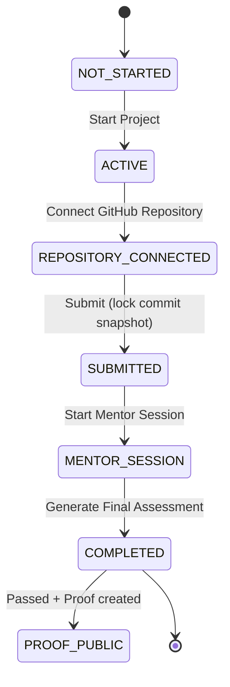

# System Design

## 1. Tech Stack Overview

Vinter is implemented as a Next.js App Router application in `vinter-app` with a server-first architecture and targeted client components.

- Runtime framework: Next.js `16.3.3` (App Router). The codebase is already aligned to the Next.js 15+ params-as-promise model by resolving dynamic route params with `use(params)` in route pages.
- Language/runtime: TypeScript + React 19.
- Styling: Tailwind CSS v4 with global CSS variables and custom brand tokens.
- Auth: NextAuth v4 (`next-auth@4.24.15`) with GitHub OAuth provider and JWT-based sessions.
- Data access: Prisma ORM (`@prisma/client@5.22.0`) with datasource provider set to `postgresql` in `prisma/schema.prisma`.
- Database target: PostgreSQL (intended for Supabase deployment).
- AI layer: Vercel AI SDK (`ai`) + Google provider (`@ai-sdk/google`) using Gemini `gemini-3.6-flash`.
- Validation/schema typing for AI output: Zod (`zod`).

Build pipeline note:

- `package.json` build script runs `prisma generate && next build` to ensure Prisma Client generation in deployment builds.

## 2. Backend Architecture & Data Model

### 2.1 API shape

The backend is implemented in App Router route handlers under `vinter-app/app/api`.

Two API styles currently coexist:

- Production data routes backed by Prisma + auth + GitHub API.
- Legacy/stub routes backed by `lib/domain.ts` mock data.

Prisma-backed core routes include:

- `POST /api/projects/[projectId]/start`
- `GET /api/home`
- `GET /api/github/repositories`
- `POST /api/user-projects/[id]/repository`
- `POST /api/user-projects/[id]/submissions`
- `POST /api/mentor-sessions`
- `POST /api/mentor-sessions/[id]/messages`
- `POST /api/user-projects/[id]/assessments`

Legacy/stub routes still using `lib/domain.ts` include examples such as:

- `GET /api/profile`
- `GET /api/jobs/[jobId]`
- `POST /api/repositories/[id]/sync`
- `GET /api/user-projects`, `GET /api/user-projects/[id]`, and related helper endpoints.

### 2.2 Domain model (Prisma)

Primary entities in `prisma/schema.prisma`:

- `User`, `Account`, `Session`, `VerificationToken`: NextAuth-compatible auth tables.
- `Project`: canonical brief definition (title, category, requirements, constraints, competencies, etc.).
- `UserProject`: user-to-project enrollment + lifecycle state (`status`) and progress.
- `Repository`: connected GitHub repository metadata for a `UserProject`.
- `RepositorySnapshot`: locked commit evidence (`commitSha`, `branch`, `fetchedAt`).
- `MentorSession`: lifecycle for AI mentor interaction.
- `MentorMessage`: persisted mentor/user messages for each session.
- `Assessment`: final evaluation outcome + summary.
- `AssessmentEvidence`: structured evidence rows tied to competencies.
- `Proof`: publicly shareable proof artifact with `publicId`, competency payload, and verification payload.

### 2.3 Transaction patterns and consistency boundaries

The code uses explicit Prisma transactions to enforce atomic lifecycle transitions:

- Mentor session creation (`POST /api/mentor-sessions`):

  - create `MentorSession`
  - create opening `MentorMessage`
  - update `UserProject.status` to `MENTOR_SESSION`
  - all in a single `prisma.$transaction`.

- Mentor reply persistence (`POST /api/mentor-sessions/[id]/messages`):

  - create mentor reply message
  - conditionally set `MentorSession.status = COMPLETED`
  - wrapped in `prisma.$transaction` when final turn closes.

- Final assessment (`POST /api/user-projects/[id]/assessments`):

  - create `Assessment` and nested `AssessmentEvidence`
  - conditionally create `Proof` when passed
  - update `UserProject.status = COMPLETED`
  - all in one `prisma.$transaction`.

Non-transactional but ordered transitions:

- `POST /api/user-projects/[id]/repository`: upsert `Repository`, then set `UserProject.status = REPOSITORY_CONNECTED`.
- `POST /api/user-projects/[id]/submissions`: create `RepositorySnapshot`, then set `UserProject.status = SUBMITTED`.

### 2.4 Auth and ownership model

- Session/auth guard pattern: `auth()` from `lib/auth.ts` used in protected routes.
- Ownership checks: `userProject.userId` validated against authenticated user before write operations.
- GitHub API calls require access token from NextAuth session callback (`session.accessToken`).

## 3. AI Integration Layer

### 3.1 Mentor conversation generation

`lib/mentor.ts` defines two generation pipelines:

- `generateMentorReview(userProjectId)`:

  - Loads project + repo/snapshot context.
  - Uses `generateText` with Gemini `gemini-3.6-flash`.
  - Produces opening context + one focused question.

- `generateMentorResponse(sessionId, userMessage)`:

  - Rehydrates full session message history from DB.
  - Computes turn index from persisted user messages.
  - Uses `generateText` with a system prompt encoding strict turn constraints.

Prompt constraints implemented in code:

- Hard cap of 4 user turns (`MAX_USER_TURNS = 4`).
- Final turn instruction requires response to begin with `SESSION_COMPLETE:`.
- Runtime completion detection: `sessionComplete = isLastTurn && text.includes("SESSION_COMPLETE:")`.

### 3.2 Structured final assessment

`lib/assessment.ts` implements `generateFinalAssessment(userProjectId)`:

- Retrieves project, latest snapshot, and latest mentor session transcript.
- Builds a deterministic assessor prompt from transcript and required competencies.
- Uses Vercel AI SDK `generateObject` + Zod schema (`AssessmentSchema`) to force typed output:
  - `summary: string`
  - `passed: boolean`
  - `evidences: { competency, question, answer, note }[]`

This structured output is directly persisted by the assessment route as normalized assessment/evidence records.

### 3.3 Persona and pedagogy rules

The mentor prompt is explicitly configured for:

- Voice: helpful, progressive, human, user-centered, Gen-Z-esque (casual but professional).
- Role: supportive manager in a Virtual Internship.
- Teaching style: Feynman technique + exploratory learning through guided reasoning/trade-offs.

## 4. UI/UX & Brand System

### 4.1 Typography

Global typography is configured in `app/layout.tsx` and `app/globals.css`:

- Inter: weights 400/600 as default body sans font (`--font-inter`).
- Capriola: weight 400 for brand/headings (`--font-capriola`, applied through heading selectors and `.font-brand`).

### 4.2 Brand color tokens

Brand colors are defined in `tailwind.config.ts` and mirrored as CSS variables in `app/globals.css`:

- `vinter-cyan-light`: `#5CD4DF`
- `vinter-cyan-dark`: `#7DE8F2`
- `vinter-bg-dark`: `#000000`
- `vinter-bg-light`: `#EFEFEF`

Theme behavior:

- Light mode background: `#EFEFEF`.
- Dark mode background: `#000000`.
- `@theme inline` maps tokens for Tailwind utility usage.

### 4.3 Proof page presentation system

`app/proofs/[publicId]/page.tsx` is a public certificate renderer with:

- Centered premium card layout.
- Deep black canvas + cyan glow gradients.
- Capriola branding for "Foundation Proof" and project title.
- Monospace cryptographic panel for repository and commit SHA evidence.
- Public proof identity (`publicId`) and timestamp presentation.

### 4.4 Product voice in empty states

Recent UI copy shifts in key screens use warmer, user-centered language (for example "Ready to build something real?") across project discovery and repository connection states.

## 5. Core User Flow (State Machine)

The primary lifecycle is modeled through `UserProject.status` transitions:

1. `NOT_STARTED`
2. `ACTIVE`
3. `REPOSITORY_CONNECTED`
4. `SUBMITTED`
5. `MENTOR_SESSION`
6. `COMPLETED` (and optional `Proof` record with public page)

Observed transitions from route handlers:

- Start project: `NOT_STARTED -> ACTIVE` via `POST /api/projects/[projectId]/start`.
- Connect repo: `ACTIVE -> REPOSITORY_CONNECTED` via `POST /api/user-projects/[id]/repository`.
- Submit snapshot: `REPOSITORY_CONNECTED -> SUBMITTED` via `POST /api/user-projects/[id]/submissions`.
- Start mentor loop: `SUBMITTED -> MENTOR_SESSION` via `POST /api/mentor-sessions`.
- Finalize assessment: `MENTOR_SESSION -> COMPLETED` via `POST /api/user-projects/[id]/assessments`.

Supporting UI logic:

- `projects/[projectId]/overview` branches rendering based on status (`ACTIVE`, `REPOSITORY_CONNECTED`, submitted/review states, `MENTOR_SESSION`).
- Mentor chat enforces turn completion and triggers assessment generation at session end.
- Proof page is accessible by `publicId` when a passing assessment creates a `Proof`.

### State diagram

## Notes and current constraints

- The codebase is mid-transition from mock-domain endpoints (`lib/domain.ts`) to full Prisma-backed endpoints.
- `prisma/seed.ts` currently seeds only one foundation project (`Authentication API`). The additional catalog items (Product Catalog API, GitHub Repository Explorer, RAG Document Assistant) are not present in current seed code.
- Some older changelog entries still mention SQLite-era details; current schema provider is PostgreSQL.